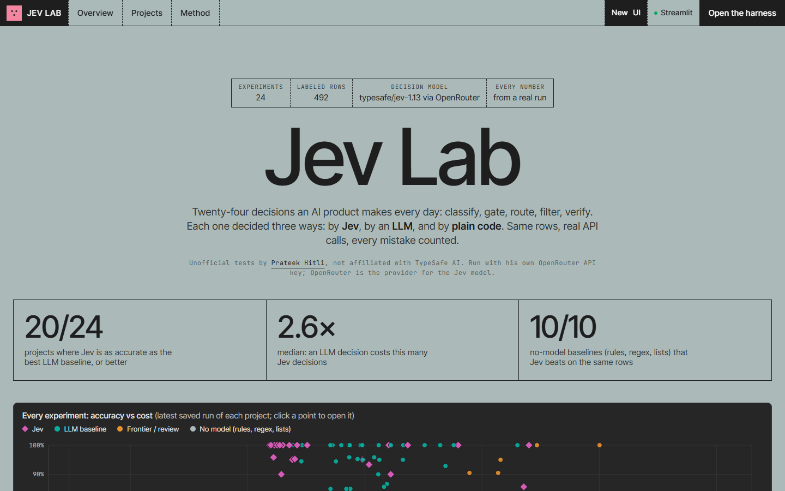
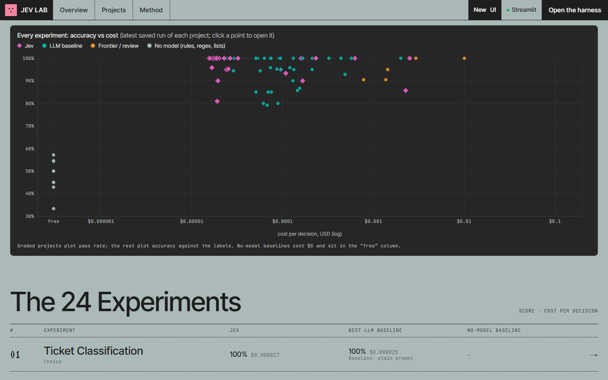
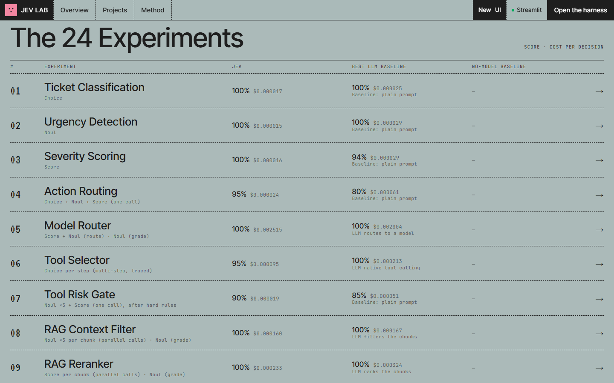
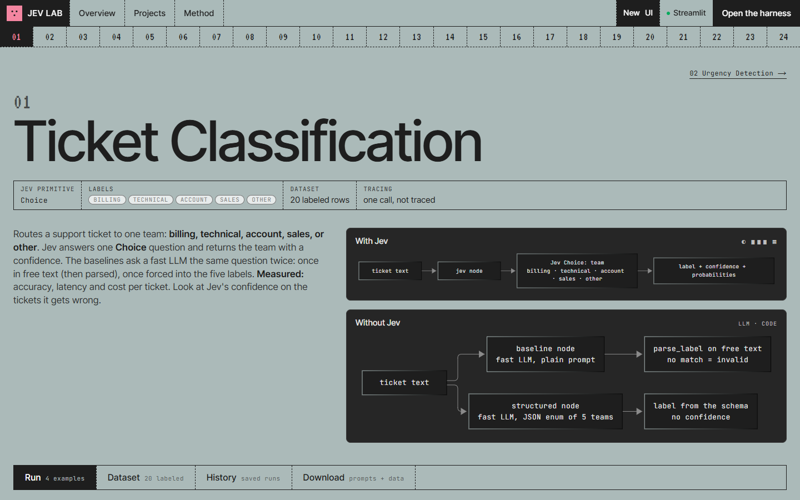
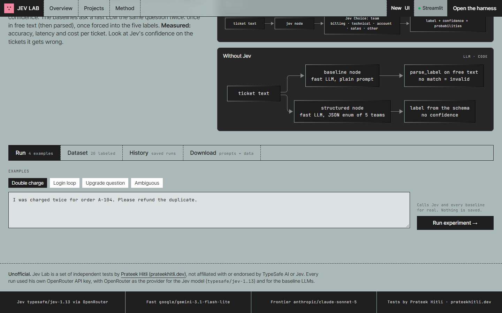
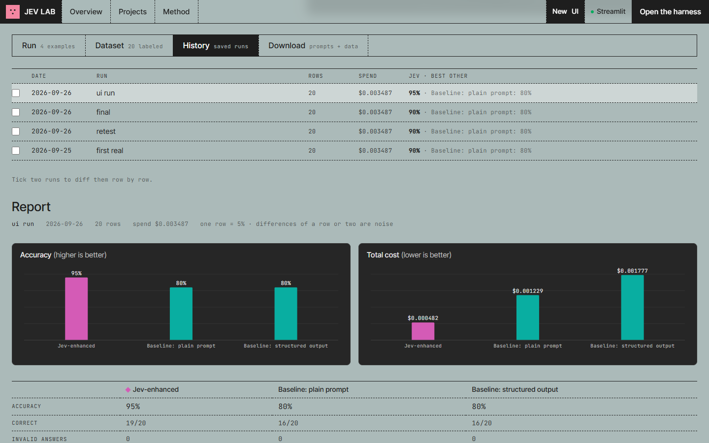
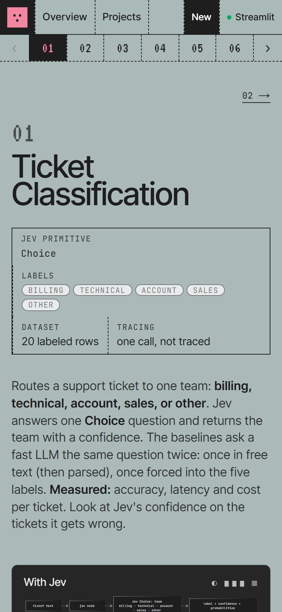
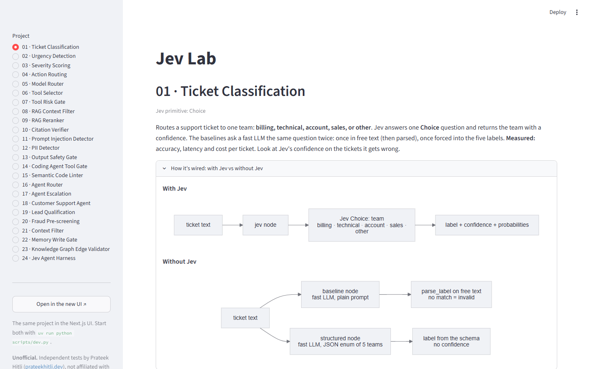

# Jev Lab

Twenty-five decisions an AI product makes every day (classify, gate, route, filter, verify), each decided three ways:
by **Jev** (`typesafe/jev-1.13`), by an **LLM** prompt, and by **plain code**. Same labelled rows, real API calls, every
mistake counted. Two UIs show the results: a Next.js app and the original Streamlit page.

> **Unofficial.** Jev Lab is a set of independent tests by Prateek Hitli ([prateekhitli.dev](https://prateekhitli.dev)),
> not affiliated with or endorsed by TypeSafe AI or Jev. Every run used his own OpenRouter API key, with OpenRouter as the
> provider for the Jev model and the baseline LLMs.



## Screenshots

Every number in these is from a saved real run (`runs/`).

**Accuracy vs cost, all 25 experiments.** Each point is one variant from a project's latest run. Click a point to open that run.



**The 25 experiments.** Jev, the best LLM baseline and the no-model baseline, each with its score and cost per decision.



**A project page.** What it decides, its Jev primitive and labels, and how it's wired with and without Jev.



**Run tab.** Try one example against Jev and every baseline, live.



**History tab.** Saved dataset runs and a run's report (accuracy, cost, per-variant table). Tick two runs to compare them row by row. Shown here: 04 Action Routing, where Jev scores 95% and the LLM baselines 80%.



<table><tr>
<td width="32%"><b>Mobile.</b> Lists paginate on phones.<br><br></td>
<td><b>Streamlit.</b> The original one-page UI, still shipped.<br><br></td>
</tr></table>

## Layout

```
jev_lab/
├── app.py            Streamlit UI (one page, every project)
├── projects/         the 25 experiments, one self-contained folder each
│   ├── 01_classification/
│   │   ├── experiment.py     the contract the UIs call (see below)
│   │   ├── jev_client.py     this project's Jev calls (plus llm.py, rules.py, tools.py … as it needs)
│   │   ├── dataset.json      labelled rows
│   │   ├── about.md          description + "With Jev" / "Without Jev" diagrams
│   │   ├── prompts.json      every system prompt it sends, captured from a real run
│   │   └── tests/            offline tests (network faked)
│   └── … 24_agent_harness/ · 25_chess/ (also a live game: the web UI's Play tab)
├── core/             run.py (Run/Result) · report.py (every metric) · projects.py (discover) · ui.py (Streamlit rendering)
├── shared/           plumbing used by ≥3 projects: Jev decide(), the no-retry chat model, grader, parsers
├── config/           settings.py (models, URLs, prices) · telemetry.py (Langfuse) · .env (keys, gitignored)
├── api/              FastAPI for the web UI: projects, runs, dataset streaming, downloads
├── web/              Next.js UI (see web/README.md)
├── scripts/          dev.py (start the servers) · capture_prompts.py · import_runs.py
├── tests/            cross-project tests: API, Streamlit, datasets, shared
├── docs/             roadmap.md (the research this started from) · screenshots/ (the README images)
├── render.yaml       Render Blueprint for the API (see Deploy)
└── runs/             saved dataset runs, shown in History (committed, so the deployed site has them)
```

Each project's `experiment.py` exposes `run_experiment(input) → Result`, `EXAMPLES`, `DATASET`, `LABELS`, `TITLE`,
`PRIMITIVE`, and optionally `SAFETY` / `SWEEP`. `core/projects.py` finds every `projects/NN_*/experiment.py`, so a new
project needs no registration. Folder names start with a digit, so modules are imported by string:
`importlib.import_module("projects.01_classification.experiment")`.

## Run it

```powershell
uv sync                                   # Python deps (pytest is a dev dependency)
cd web; npm install; cd ..                # first time only, for the web UI
uv run python scripts/dev.py              # API :8000, web UI :3737, Streamlit :8501 (Ctrl+C stops all)
uv run pytest -q                          # offline tests: no keys, no spend
```

Keys go in `config/.env` (template: `config/example.env`). One OpenRouter key (`OPENROUTER_API_KEY`) covers Jev
(`typesafe/jev-1.13`, called through OpenRouter's Decisions API) and every baseline LLM; no TypeSafe key is needed.
Langfuse keys are optional. Real runs cost money: a full dataset run of all
24 projects is about $0.51.

## Deploy

The API goes to **Render** and the web UI to **Vercel**. Secrets are typed into their dashboards and never committed.

1. **Push** this repo to GitHub.
2. **Render (API):** New → Blueprint → pick the repo. It reads `render.yaml` and asks for three values:
   - `OPENROUTER_API_KEY`: your OpenRouter key. It's the only secret, and it pays for Jev and the baselines.
   - `WEB_ORIGINS` and `WEB_UI_URL`: the Vercel URL, e.g. `https://jev-labs.vercel.app`. You don't have it yet, so put a
     placeholder and fix it in step 4.

   When it's live, `https://<api>.onrender.com/api/projects` lists 25 projects. The free plan sleeps when idle, so the
   first visit after a while takes about 30 s.
3. **Vercel (web):** Add New → Project → the same repo. Set **Root Directory** to `web`; the framework is detected as
   Next.js. Environment variables, both set to the Render URL:
   - `JEV_API_URL=https://<api>.onrender.com` (server-side pages and the `/api` rewrite)
   - `NEXT_PUBLIC_API_URL=https://<api>.onrender.com` (the browser's Run and Dataset calls)

   Deploy.
4. **Back on Render:** set `WEB_ORIGINS` and `WEB_UI_URL` to the real Vercel URL. Saving redeploys the API.
5. **Backstop:** set a credit limit on the OpenRouter key (openrouter.ai → Keys).

**Spam limits.** Run and Dataset spend your key, so the API caps them. The values are in `render.yaml` and you can
change them in the Render dashboard (0 = off; locally they're off):

| Setting | Default | Caps |
|---|---|---|
| `RUN_LIMIT_PER_IP_HOUR` | 20 | single runs per visitor per hour |
| `RUN_LIMIT_PER_DAY` | 300 | single runs per day, everyone together |
| `DATASET_LIMIT_PER_IP_HOUR` | 3 | dataset runs per visitor per hour |
| `DATASET_LIMIT_PER_DAY` | 30 | dataset runs per day, everyone together |

At these values the worst case stays well under $2 a day. The counters live in memory, so a restart resets them.

**Also:**
- Runs made on the deployed site are saved to Render's disk, which is wiped on every deploy. The committed `runs/`
  come back each time.
- Streamlit isn't deployed, and the nav toggle then shows how to start it locally.
- `web/.npmrc` points npm's cache at a local `D:` path. If Vercel's install fails on it, delete the file.

## Adding a project

1. Create `projects/26_name/` with `experiment.py` (the contract above), `dataset.json`, `about.md` and `tests/`.
2. `uv run pytest -q`: `tests/test_datasets.py` checks the dataset and the diagrams against the graph.
3. `uv run python scripts/capture_prompts.py 26` records its prompts for the Download tab (real calls, cents).
