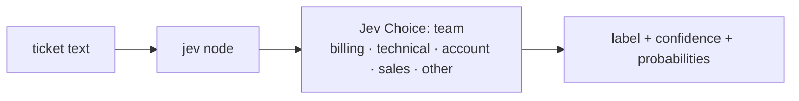
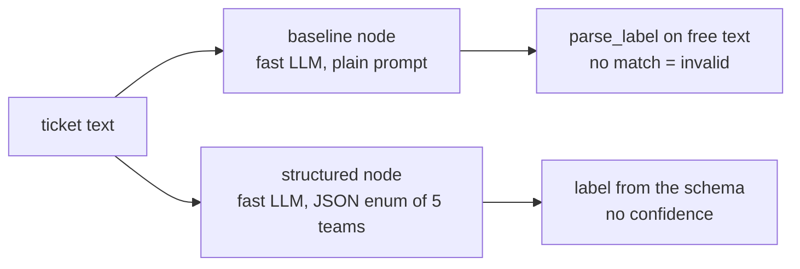

Routes a support ticket to one team: **billing, technical, account, sales, or other**.
Jev answers one **Choice** question and returns the team with a confidence. The baselines ask a fast LLM the same
question twice: once in free text (then parsed), once forced into the five labels.
**Measured:** accuracy, latency and cost per ticket. Look at Jev's confidence on the tickets it gets wrong.

## With Jev

## Without Jev

