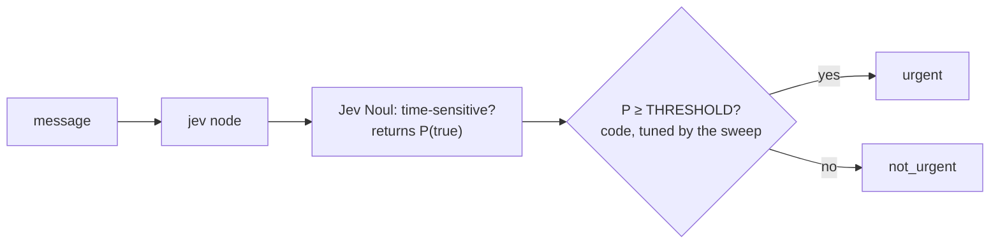
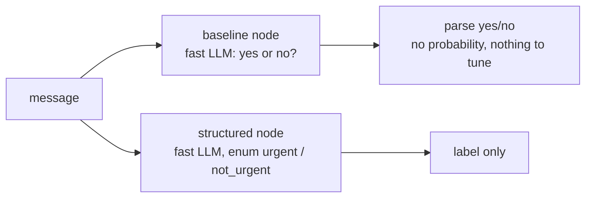

Detects whether a customer message is **urgent**. Jev answers one **Noul** (a true/false statement) and
returns P(urgent). Code turns that into a label with a threshold you tune on the Dataset tab (the sweep), so the
cut-off is a business decision, not the model's. The baselines answer yes/no in free text, or forced into two labels.
**Measured:** accuracy, latency, cost, and the threshold sweep.

## With Jev

## Without Jev

