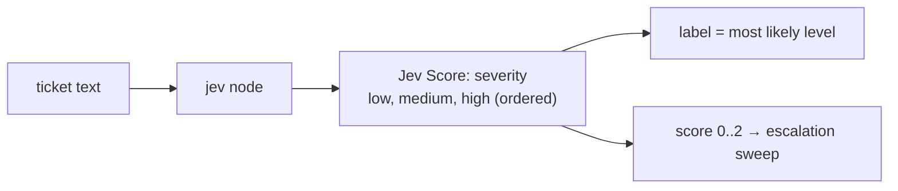
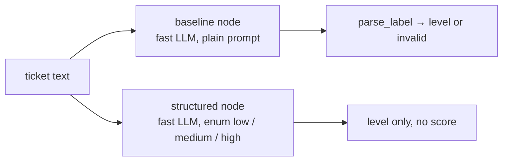

Scores how **severe** a ticket is: **low, medium, or high**. Jev answers one **Score** question over three
ordered levels and returns a probability-weighted score (0–2) with a confidence. The label is the most likely level,
and the score feeds an "escalate if score ≥ t" sweep. The baselines pick a level in free text, or from an enum.
**Measured:** accuracy, latency, cost, and the escalation sweep.

## With Jev

## Without Jev

