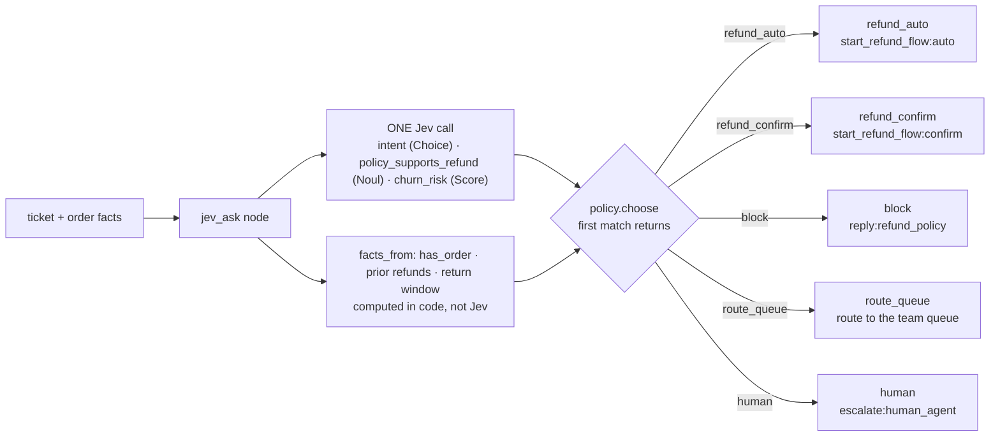
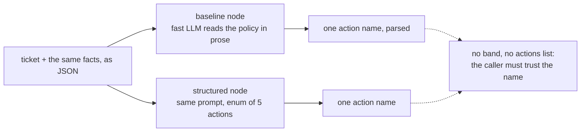

Turns a support ticket into **one action**: refund automatically, refund after confirmation, deny by
policy, route to a team, or hand to a human. Jev answers three questions in **one call**: intent (Choice), policy
support (Noul) and churn risk (Score). Counting and dates are computed in code, a pure policy decides, and the
graph's conditional edge is the only way to reach each action node. The baselines read the policy in prose and pick
the action themselves. **Measured:** accuracy and cost, plus proof that an auto-refund can only happen on its edge.

## With Jev

## Without Jev

