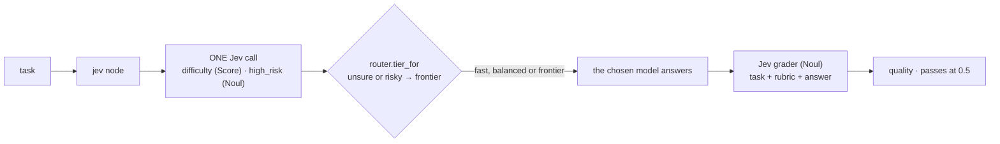
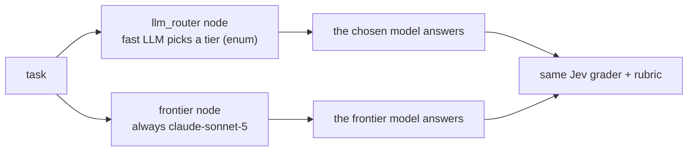

Picks **which model answers a task**: fast, balanced, or frontier. Jev judges difficulty (Score) and
risk (Noul) in one call, code maps them to a tier (every doubt routes up), and only that model answers. Every
answer, from every variant, is graded by one Jev Noul against a rubric the answering models never see.
**Measured:** pass rate and **cost per passing answer** (routing + answering; grading is kept apart).

## With Jev

## Without Jev

