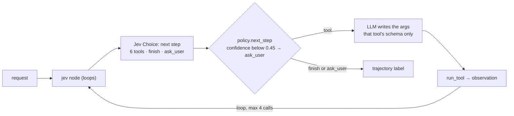
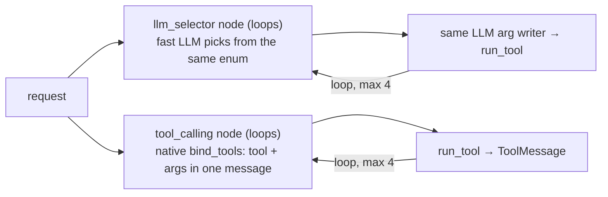

An **agent** that loops: pick the next tool (or stop), write its arguments, run it, look at the result.
Jev picks from a closed list (6 tools, plus finish and ask_user) and reports a confidence. An LLM writes the
arguments, and only for the chosen tool. The tools are offline fakes, and every loop stops at 4 tool calls. The label
is the **whole trajectory** (e.g. `database > calculator`). **Traced:** every loop turn and every model call, with
its cost, in Langfuse.

## With Jev

## Without Jev

