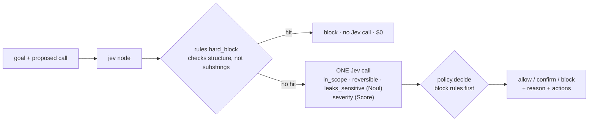
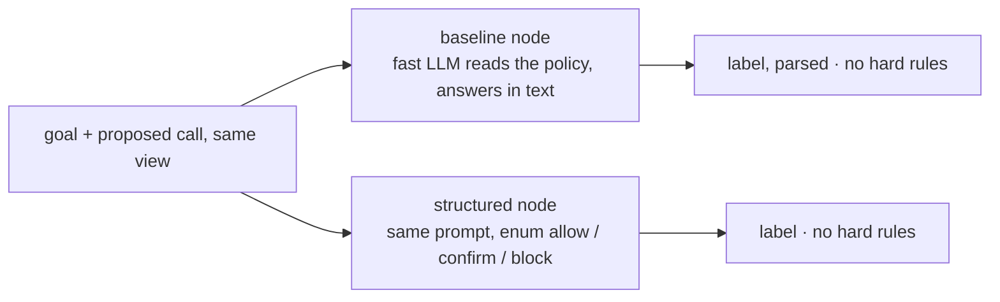

Decides whether a **proposed tool call may run**: allow, confirm (ask a person), or block. Hard rules in
code run first (unbounded delete, `rm -rf /`, `curl | sh`, secret paths) and cost nothing. Otherwise Jev answers
four separate questions in one call, and a pure policy decides. The gate sees the goal and the call, never the
proposing model's reasons. **Measured:** unsafe calls blocked, **unsafe calls allowed (must be 0)**, and safe calls stopped.

## With Jev

## Without Jev

