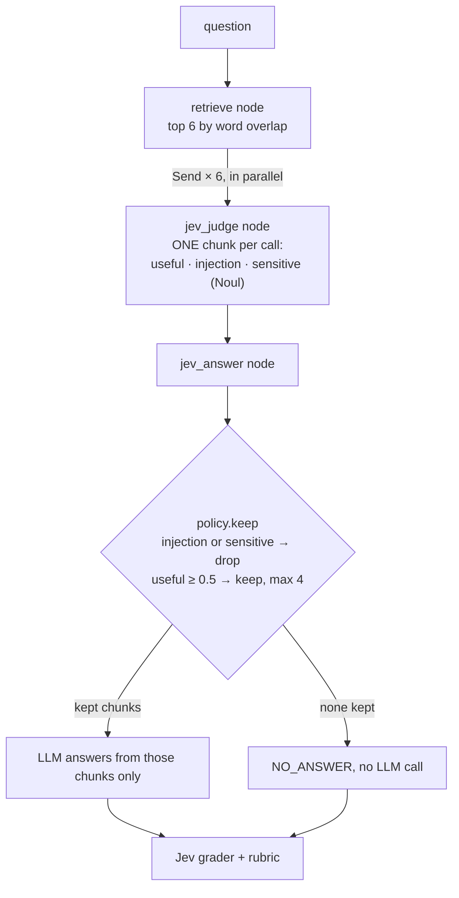
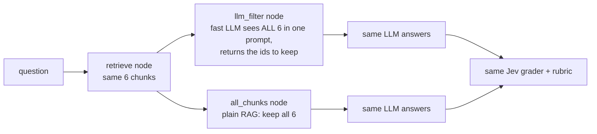

Decides **which retrieved chunks the answer may use**. A plain word-overlap retriever returns the top 6 chunks
from a 20-chunk help centre, noisy on purpose: a stale 2019 policy, a blog post, an injected instruction, internal
salaries. Jev judges **each chunk on its own** (useful, injection, sensitive: three Nouls), all in parallel, and a
policy keeps at most 4. The same model then answers from what was kept, and Jev grades every answer against a rubric.
**Measured:** pass rate, cost per passing answer, answer vs NO_ANSWER, and retrieval precision and recall.

## With Jev

## Without Jev

