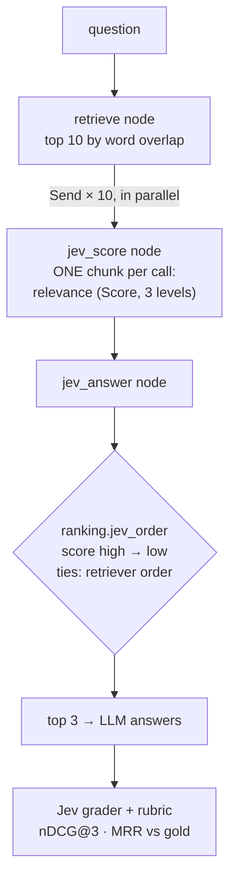
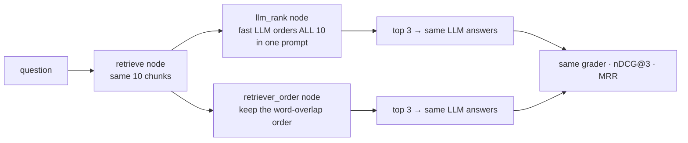

Decides **what order the retrieved chunks go in**, because only the top 3 reach the answer. A word-overlap
retriever returns 10 chunks from a 30-chunk help centre, with overview and FAQ pages that repeat the question's words
but don't answer it. Jev gives **each chunk its own relevance Score** (irrelevant, background, directly answers),
all 10 calls in parallel, and the chunks are sorted by it. The same model answers from the top 3, and Jev grades it.
**Measured:** nDCG@3 and MRR against gold relevance grades, plus pass rate and cost per passing answer.

## With Jev

## Without Jev

