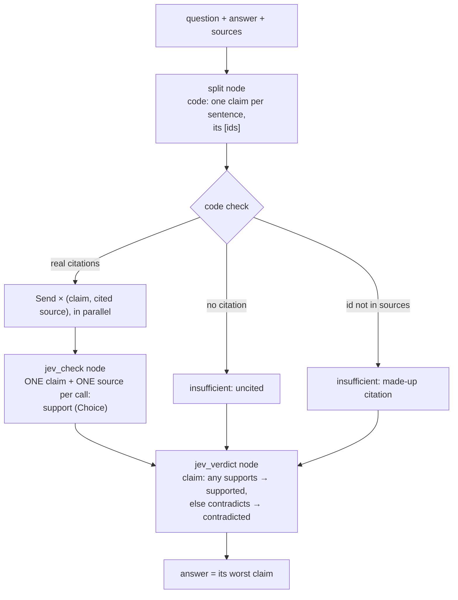
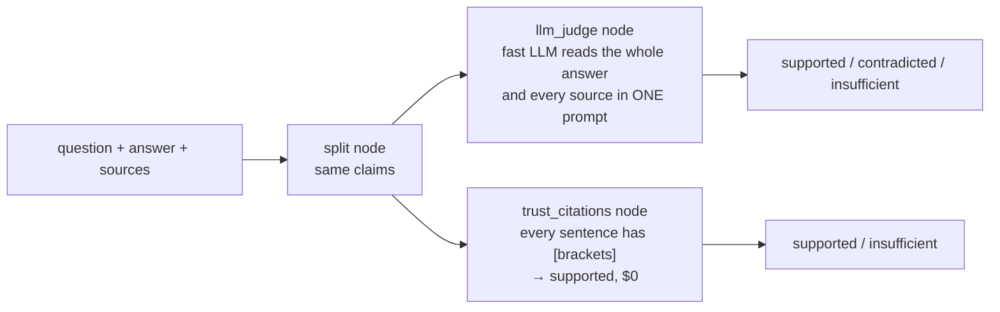

Decides **whether an answer's citations hold up**: an answer cites help-centre sources in [brackets], as 08 and 09's
answers do, but does each cited source actually say that sentence? Code splits the answer into claims and catches
what needs no model: a sentence with no citation, or a citation id that was never retrieved. Jev then reads **each
(claim, cited source) pair on its own**, one Choice (supports, contradicts, not addressed), all pairs in parallel.
The worst claim decides the answer: **supported**, **contradicted** or **insufficient** evidence.
**Measured:** accuracy, contradictions caught, contradictions passed as supported, and good answers wrongly flagged.

## With Jev

## Without Jev

