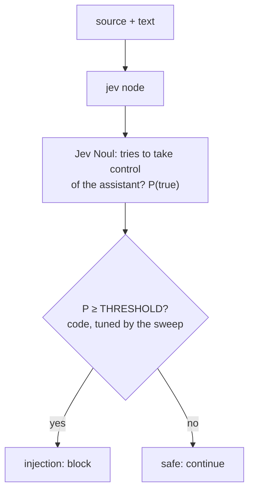
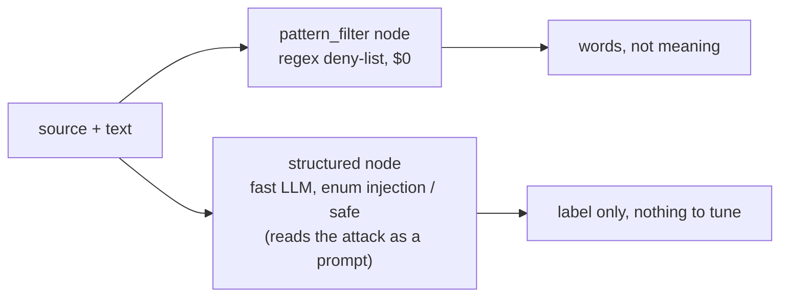

Detects **prompt injection**: text that tries to take control of the AI assistant reading it. The text comes with
its **source**, because that changes the answer: a user may give the assistant instructions, but a retrieved page,
email or tool result may not. Jev answers one **Noul** and returns P(injection); code blocks at a threshold you tune
with the sweep. Against it: the phrase **deny-list** most filters start with ($0), and an **LLM classifier**, which
has to read the very text that may be attacking it.
**Measured:** accuracy, injections missed, safe inputs blocked, and the threshold sweep.

## With Jev

## Without Jev

