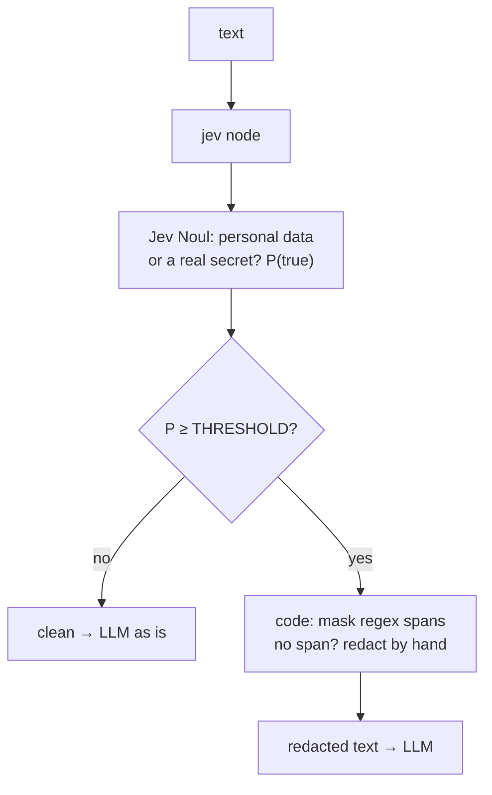
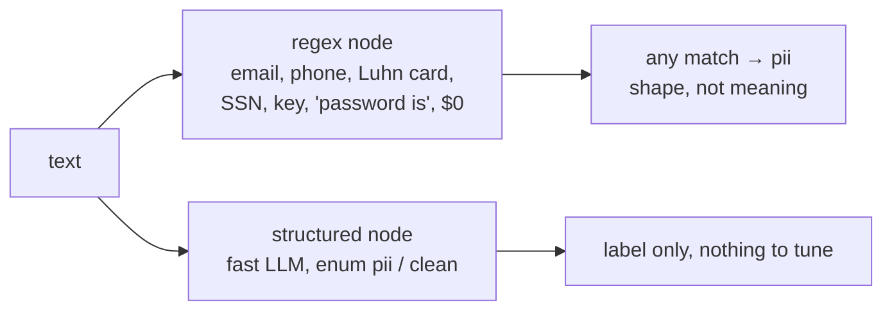

Detects whether a message carries **a real person's personal data or a real secret** (password, API key), so it
can be redacted before it reaches an LLM. Code does what regexes are good at: finding email-, phone-, card- (Luhn-checked), SSN- and key-shaped strings,
and masking them. Whether a match is really a person's data (a customer's email or `support@`, a real card or
Stripe's test card) and whether there is PII no regex can see (a name with a home address and a diagnosis, an
email spelled out in words) is judgment: **one Jev Noul**, with a threshold tuned by the sweep.
**Measured:** accuracy, PII missed, clean text flagged, and the threshold sweep.

## With Jev

## Without Jev

