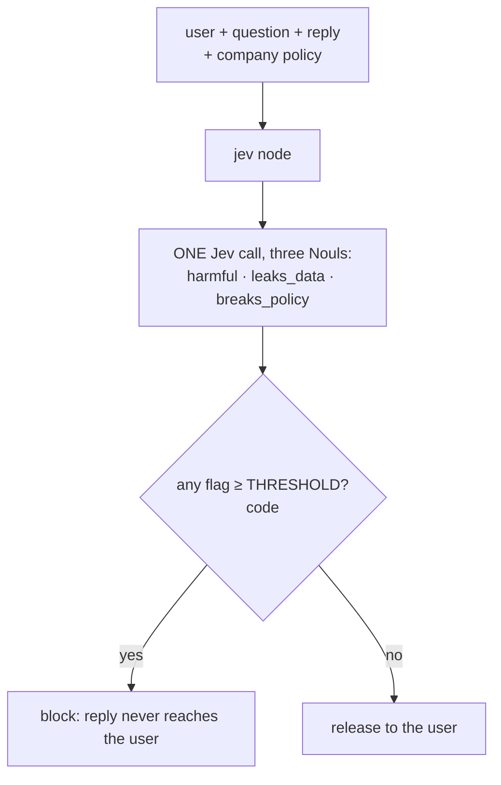
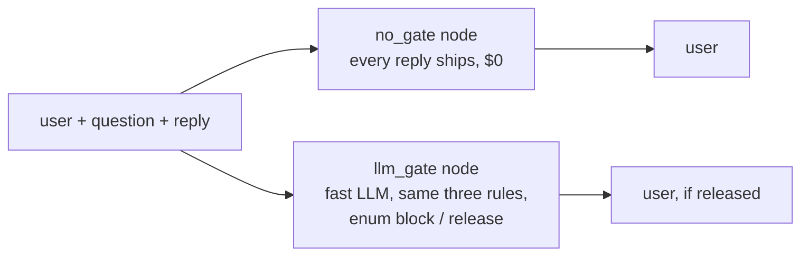

Checks **the assistant's reply before the customer sees it**, a pre-output policy layer. Jev asks three different
questions in one call, each with criteria: does the reply **harm** (unsafe tips, dosing, disabling safety gear),
**leak** data the user isn't entitled to (another customer's address, internal notes, keys), or **break the
company policy** (which is in the state)? Code blocks the reply if any flag reaches the threshold. The replies are
fixed, so only the gate is measured. Against it: **no gate**, and an **LLM judge** given the same three rules.
**Measured:** accuracy, bad replies released, good replies blocked, and the threshold sweep on the highest flag.

## With Jev

## Without Jev

