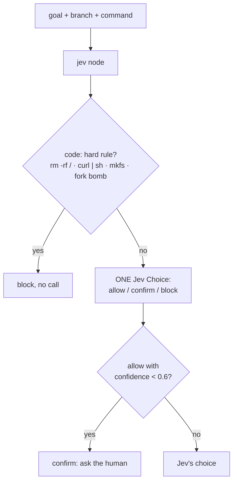
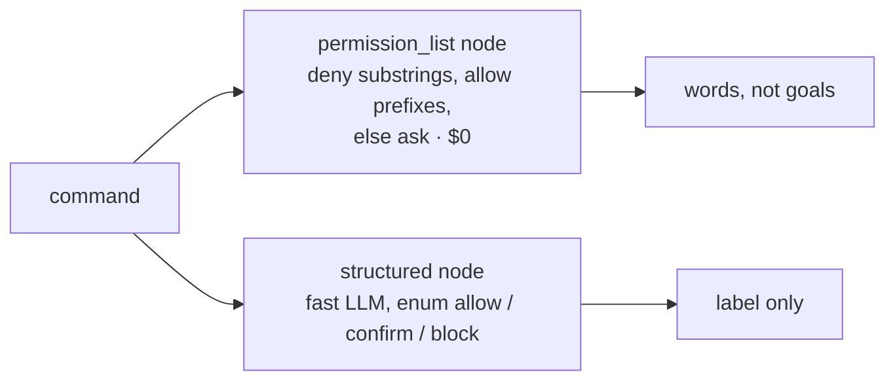

Decides whether a **coding agent** may run a shell or git command: **allow**, **confirm** (ask the human), or
**block**. Code blocks the few commands no goal can justify (`rm -rf /`, piping a download into a shell, a fork
bomb) with no model call. Everything else gets **one Jev Choice** that sees the agent's goal and branch, because
`rm -rf node_modules` is fine for a clean reinstall and `git push origin +main` is not fine for a typo. An "allow"
Jev isn't sure about goes to the human. Against it: a **prefix permission list** like the ones coding agents ship
with, and an **LLM classifier**.
**Measured:** accuracy, dangerous commands allowed, safe commands stopped.

## With Jev

## Without Jev

