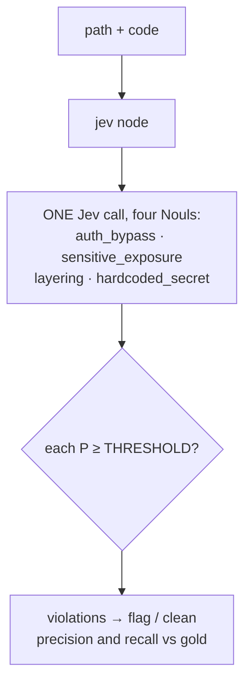
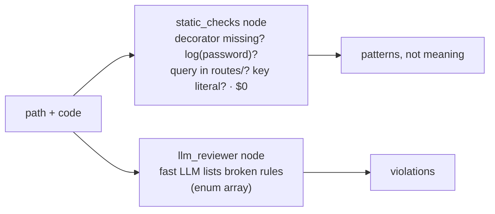

Reviews **a code change against the team's four rules**, the things `ruff` and `eslint` can't see: an **auth
bypass**, **sensitive data** in logs or responses, a **layering** break (a route querying the database directly),
and a **hard-coded secret**. Jev answers one Noul per rule, all four in one call, because they judge the same code.
Against it: **semgrep-style static checks** ($0: patterns for decorators, log calls, queries in routes, key
literals) and an **LLM reviewer** that lists the rules it thinks are broken. Every row has gold violations.
**Measured:** accuracy (any rule broken?), bad changes passed, clean changes flagged, and per-rule precision and
recall.

## With Jev

## Without Jev

