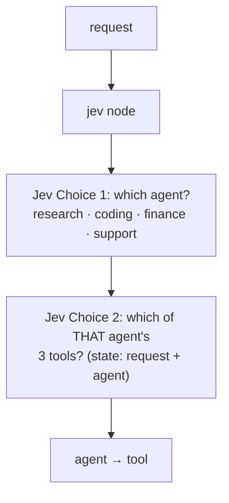
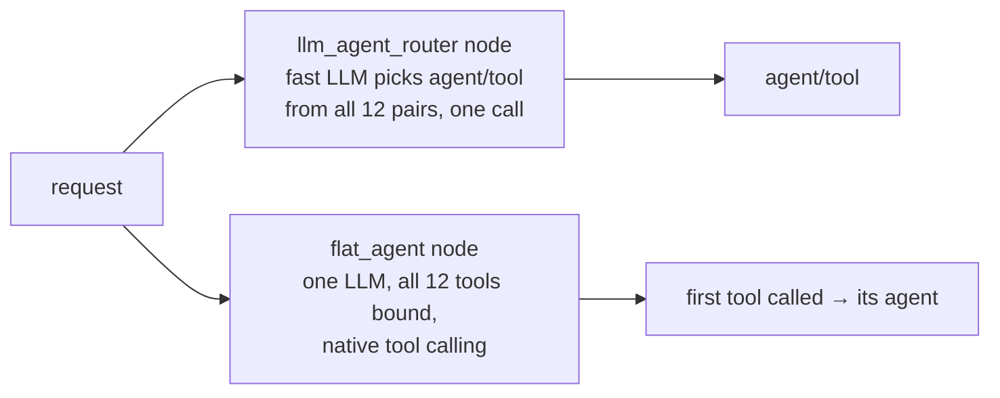

Routes a request to **one of four agents** (research, coding, finance, support), then picks **which of that agent's
three tools** the request needs. Jev makes two small decisions: a Choice over the agents, then a Choice over
only that agent's tools, with the chosen agent in its state. Against it: an **LLM router** choosing agent/tool from
the whole tree in one call, and the **one flat agent** approach, where all 12 tools are bound to a single model at
once. The requests are full of words that belong to another agent ("refund" in a code question, "invoice" as a code
symbol). Traced: two Jev generations per request.
**Measured:** agent accuracy (the label), agent + tool accuracy, tokens and cost.

## With Jev

## Without Jev

