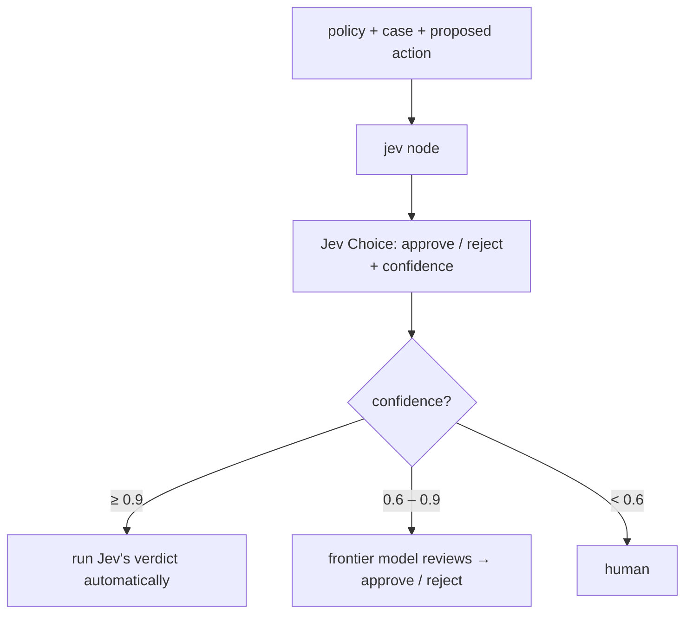
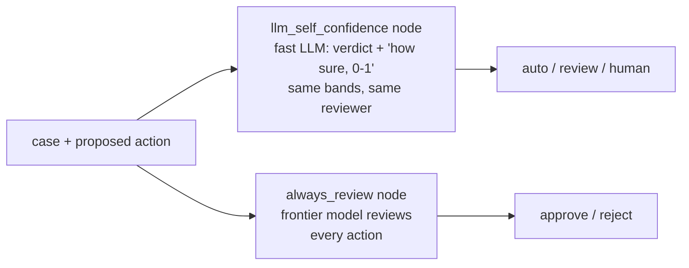

Turns **uncertainty into a control signal**. A support agent has proposed an action (a refund, a label, a credit);
before it runs, a decision gets a confidence, and the confidence picks the path: **≥ 0.9 runs automatically**,
**0.6–0.9 goes to a stronger reviewer** (the frontier model), **< 0.6 goes to a human**. Jev gives the verdict as a
Choice (approve / reject) with the policy in its state, and its **confidence** sets the band. Against it: the same
bands driven by the **LLM's self-reported confidence**, and **reviewing every action** with the frontier model.
**Measured:** wrong actions executed (must be 0), good actions run automatically, share sent to review and to a
human, and cost.

## With Jev

## Without Jev

