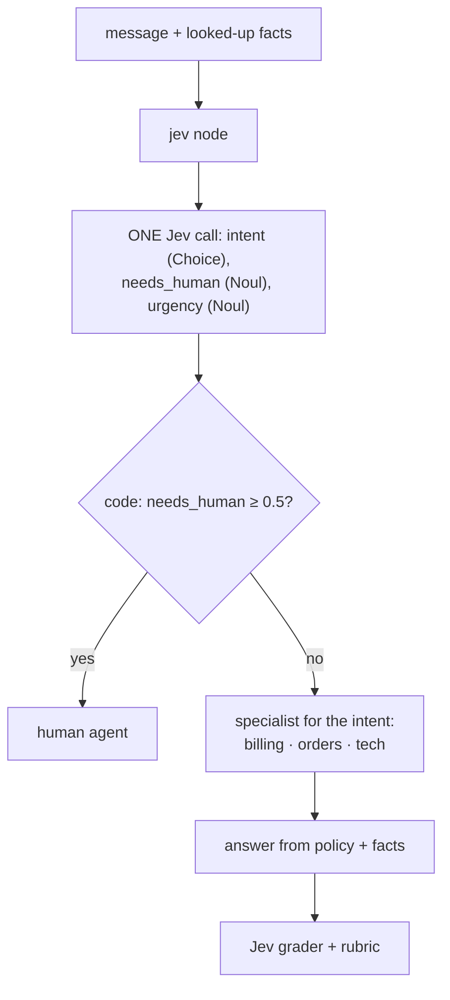
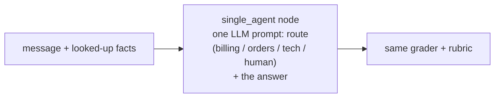

A **customer support agent, end to end**: triage, route, look up the facts, answer. Jev triages in **one call**
with three questions: the **intent** (billing, orders, tech), whether the message **needs a human** (a legal
threat, an injury, a threat to leave, a security incident, however calmly written), and **urgency** (priority).
Code routes: a human if needed, otherwise the right specialist. The specialist answers from the looked-up order
facts, and Jev's grader scores every answer against a rubric. Against it: **one LLM agent** that picks the route
and writes the answer in a single prompt. Traced.
**Measured:** route accuracy, answers passing the grader, cost per passing answer.

## With Jev

## Without Jev

