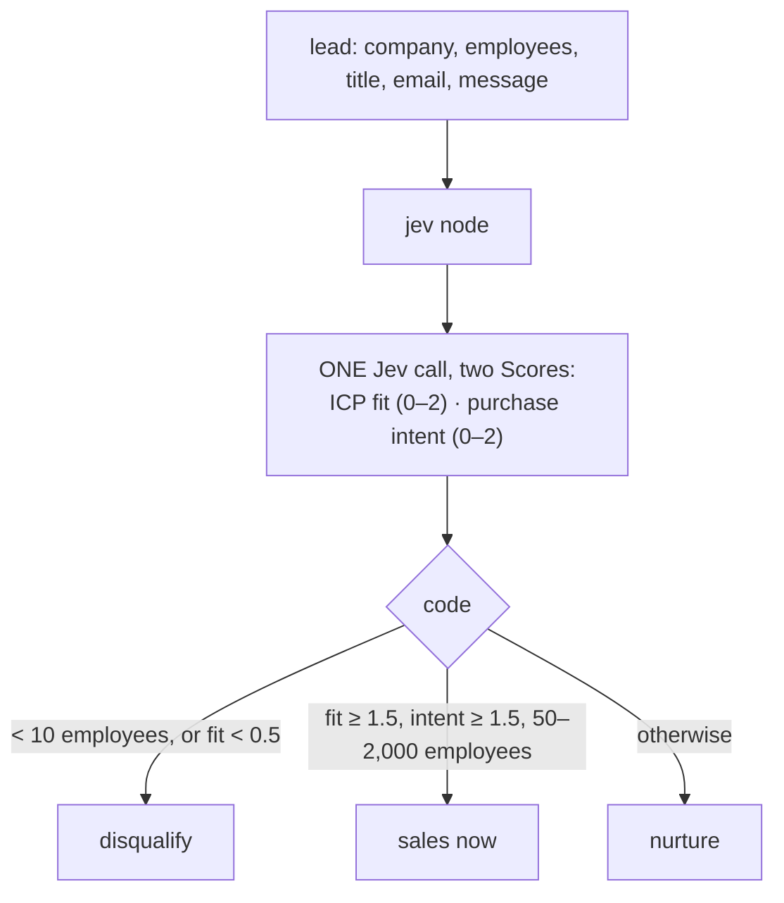
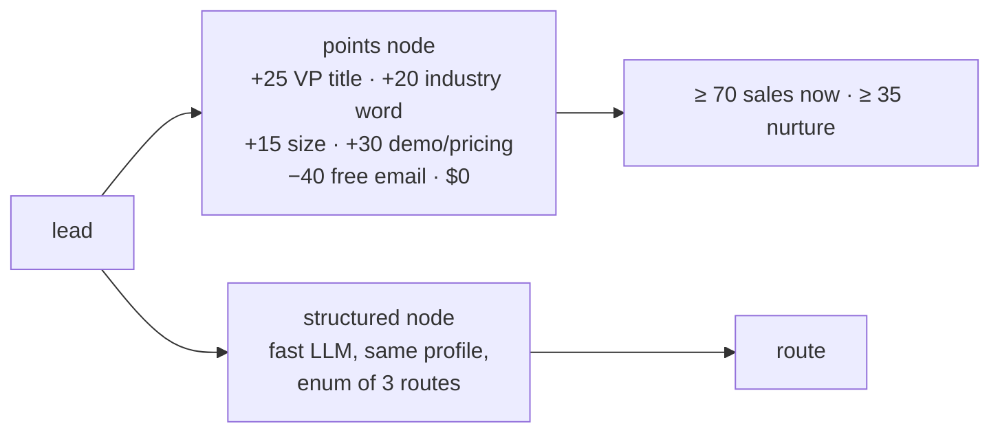

Qualifies an inbound **sales lead**: **sales now**, **nurture**, or **disqualify**. Code checks the facts it can
(company size against the profile's 50 to 2,000 employees; fewer than 10 is out). Jev answers two Scores in one
call: **ICP fit** (industry, buyer, pain, disqualifiers such as a competitor or a student) and **purchase intent**
(browsing, exploring, actively buying). Code turns the two scores into a CRM route. Against it: **points-based lead
scoring** ($0: points for a VP title, industry words, size, "demo" or "pricing"), and an **LLM classifier** given
the same profile.
**Measured:** route accuracy, and where each variant sends the tricky leads.

## With Jev

## Without Jev

