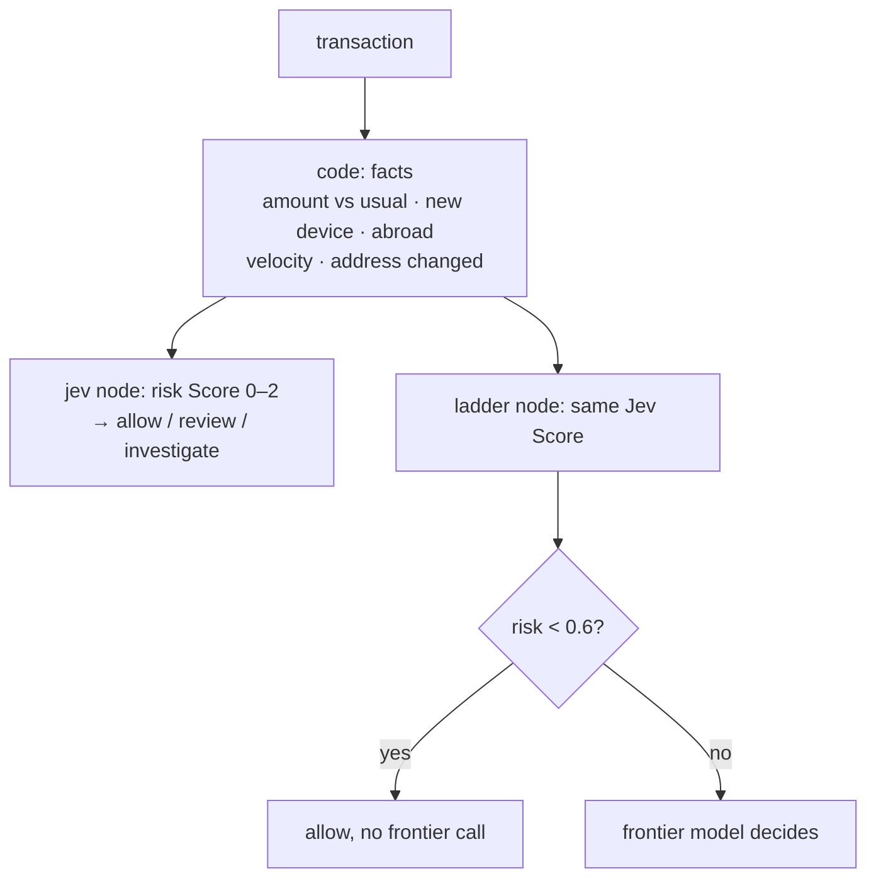
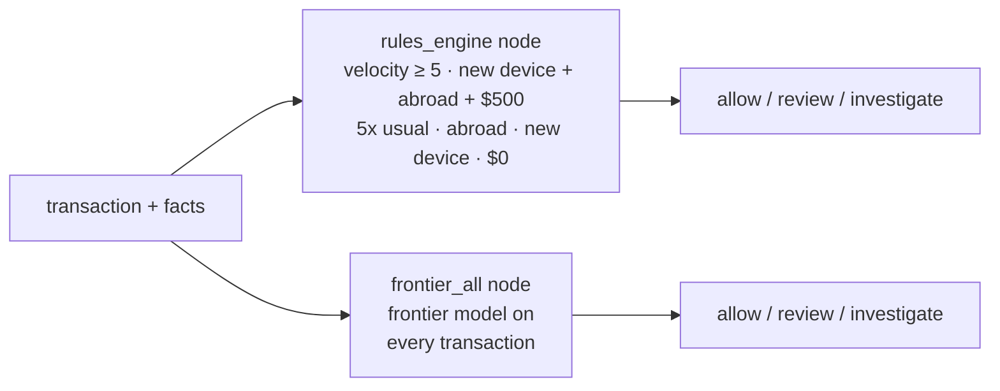

Pre-screens **synthetic card transactions**: **allow**, **review**, or **investigate**. Code computes the facts
(amount vs the customer's usual, new device, abroad without a travel notice, transactions in the last hour,
address changed today). Jev reads the transaction and those facts and gives a **risk Score** (low, medium, high),
and code bands it. The **ladder** is the readme's cost idea: Jev screens everything, and only the transactions it
doesn't call low go to the expensive **frontier model**. Against them: a **rules engine** on the same facts ($0),
and the **frontier model on every transaction**. Traced.
**Measured:** accuracy, fraud allowed, good customers stopped, share sent to the frontier, and cost per
transaction.

## With Jev

## Without Jev

