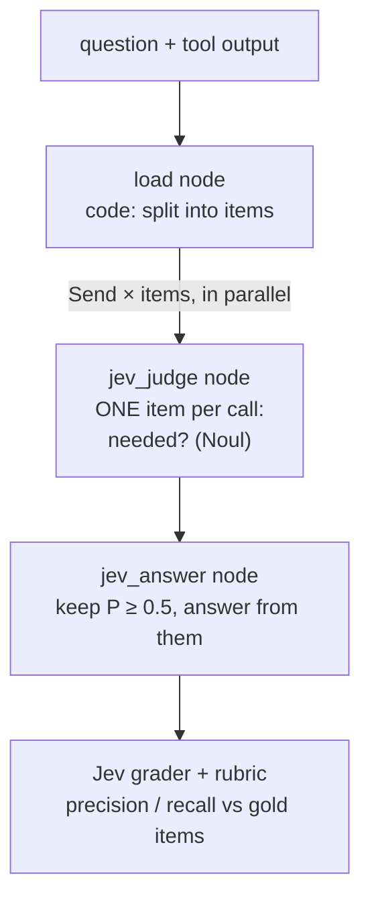
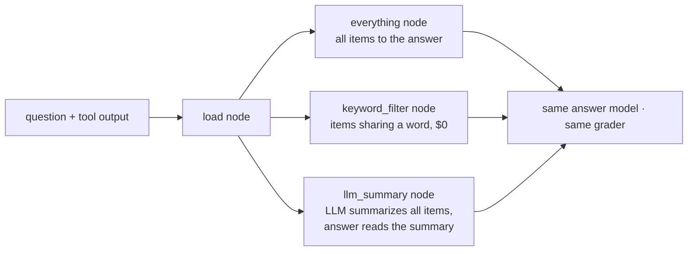

Filters a **big tool output** before an agent's LLM reads it (context pollution). A GitHub issues list (30 issues)
or a CI log (26 lines) is split into items in code, and Jev judges **each item on its own**, all in parallel:
is this item needed to answer the question? Only the kept items reach the answer. Against it: **sending the whole
output**, an **LLM that summarizes first**, and a **keyword filter** (grep, $0). The same model answers in every
variant, and Jev's grader scores every answer. Traced.
**Measured:** pass rate, cost per passing answer, **tokens given to the answer**, and item precision and recall.

## With Jev

## Without Jev

