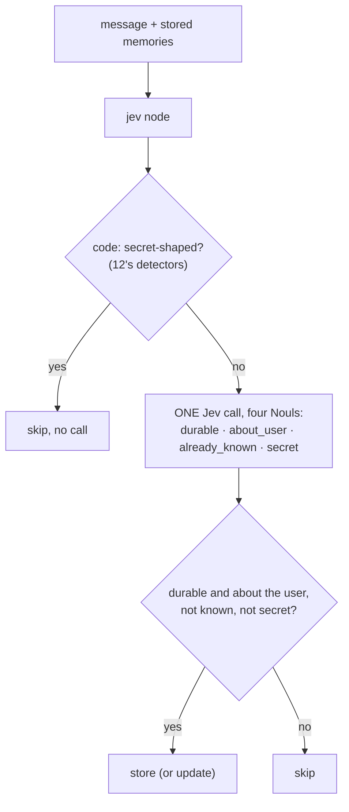
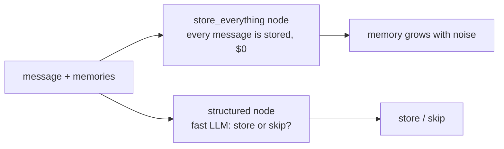

Decides whether what the user just said should become **long-term memory**, so the assistant's memory holds
lasting facts and not noise. Jev answers four questions in one call: is it **durable** (still true and useful in a
month), is it **about the user** themself, is it **already known** (given the stored memories; a change to a
stored fact counts as new), and does it contain a **secret**? Code stores it only if all four say so; secret-shaped
strings (project 12's detectors) are refused before any call. Against it: **storing everything**, and an **LLM
asked "should I remember this?"**.
**Measured:** accuracy, junk stored, facts lost.

## With Jev

## Without Jev

