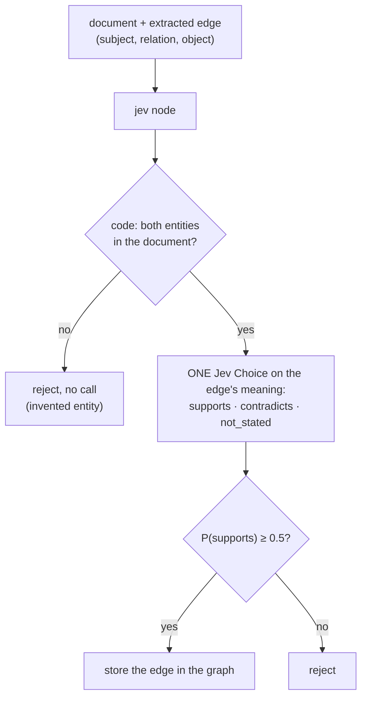
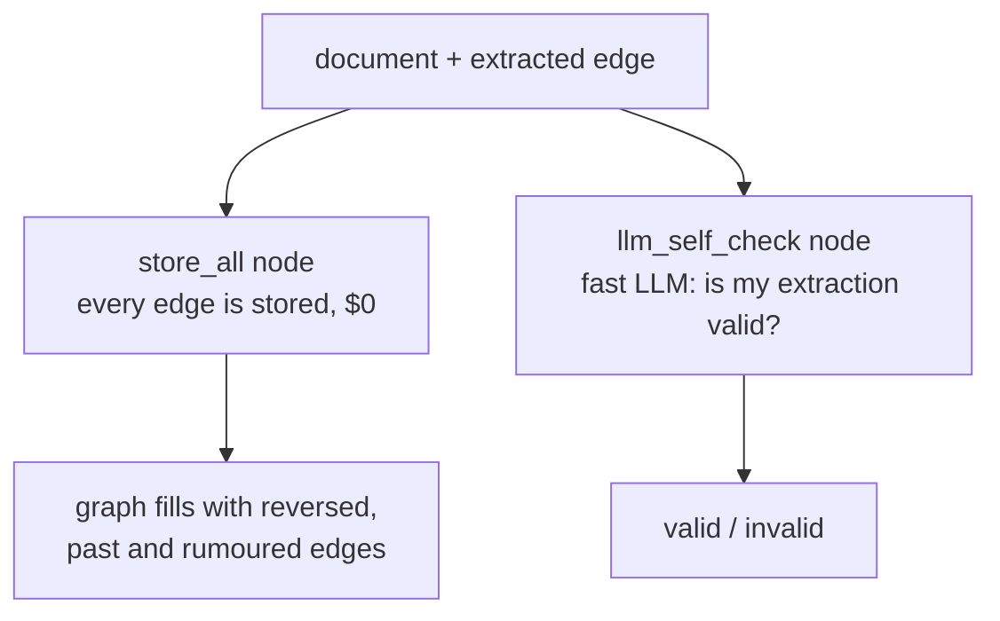

Decides whether an **edge an LLM extracted from a document** (subject, relation, object) may go into the
**knowledge graph**. Code first checks that both entities appear in the document (an invented entity is rejected
for free). Then one Jev **Choice** reads the document and the edge's meaning in words, and answers **supports**,
**contradicts** or **not_stated**. The traps are the ones that poison graphs: a **reversed direction**, a **past
fact** stored as current ("previously", "before that"), a **declined offer**, a **rumour**, a **wrong relation**.
The edge is stored only when P(supports) ≥ 0.5 (a threshold sweep shows the tradeoff). Against it: **storing every extracted edge**, and the **LLM checking its own
extraction**.
**Measured:** accuracy, bad edges stored, good edges rejected.

## With Jev

## Without Jev

