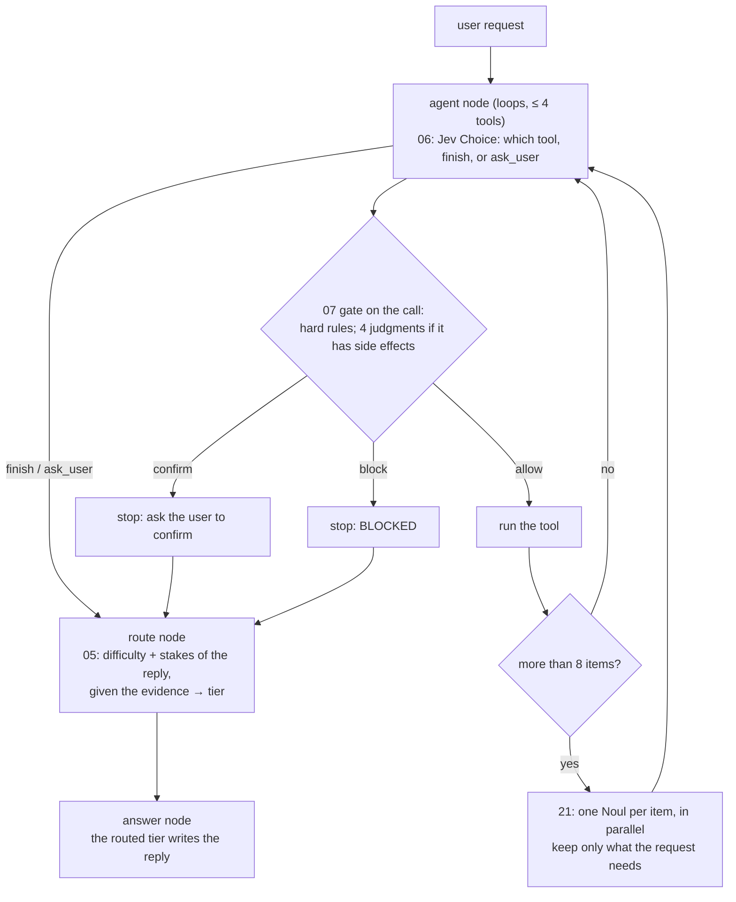
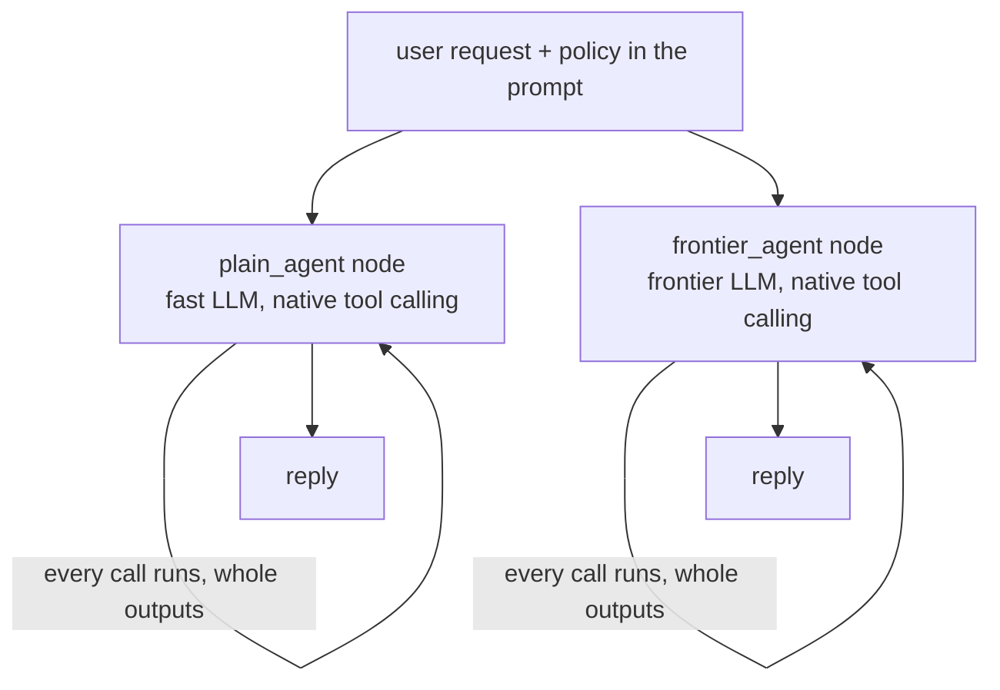

The **Jev agent harness** (the readme's Level 9): the earlier projects' Jev pieces composed into one agent, each
**imported from its own project**, not rewritten.
- **06's tool router** picks the next tool, or stops.
- **07's gate** runs its hard rules on every proposed call, and its four judgments on every call with side effects
  (read-only tools are known in code and skip them): allow, confirm (the agent stops and asks), or block (the turn
  ends and the reply explains).
- **21's relevance filter** judges each item of a big tool output, so the reply only reads what it needs.
- **05's route** picks which model tier writes the reply, once the tools have run: on the request plus the evidence.

Against it: a **plain tool-calling agent** on the fast model, and the **same agent on the frontier model**. Both are
told the same policy in their prompt; only the harness enforces it.
**Measured:** pass rate (graded), cost per pass, rows where a forbidden call **ran**, tokens given to the reply.

## With Jev

## Without Jev

