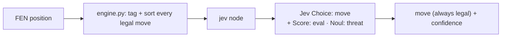
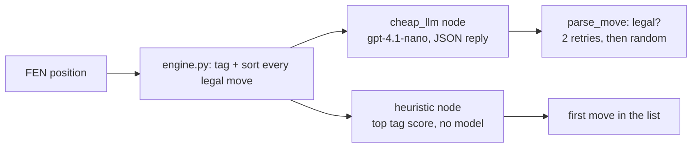

Plays chess: **Jev against a cheap OpenAI model** (gpt-4.1-nano by default). Python does the tactics
bookkeeping before any model is asked: every legal move is tagged (CHECKMATE, SAFE capture,
TRADEs, THREATENS, PASSED PAWN, BOXES IN their king, BLUNDER, repeats) and sorted so forcing, game-ending moves come first.
Both players are told to win fast: trade down when ahead, never shuffle, and break a stalled game. Jev answers one **Choice** over those tagged moves, plus a **Score**
(who stands better) and a **Noul** (is a piece hanging). The LLM gets the same tags as a prompt and replies in JSON.
**Run / Dataset:** twelve labelled tactics positions. A variant scores when it plays one of the accepted moves.
**Play:** a full game, move by move, with cost, tokens and the raw request/response of every ply.
**Measured:** accuracy per tactic, latency and cost per move. The no-model heuristic shows how much of the work
the tags already do. One back-rank row is a mate-in-2 trap that the 1-ply scan can't see.

## With Jev

## Without Jev

